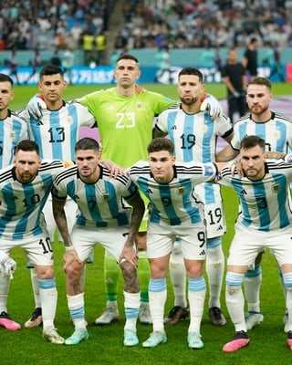
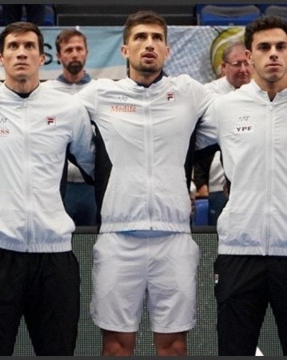
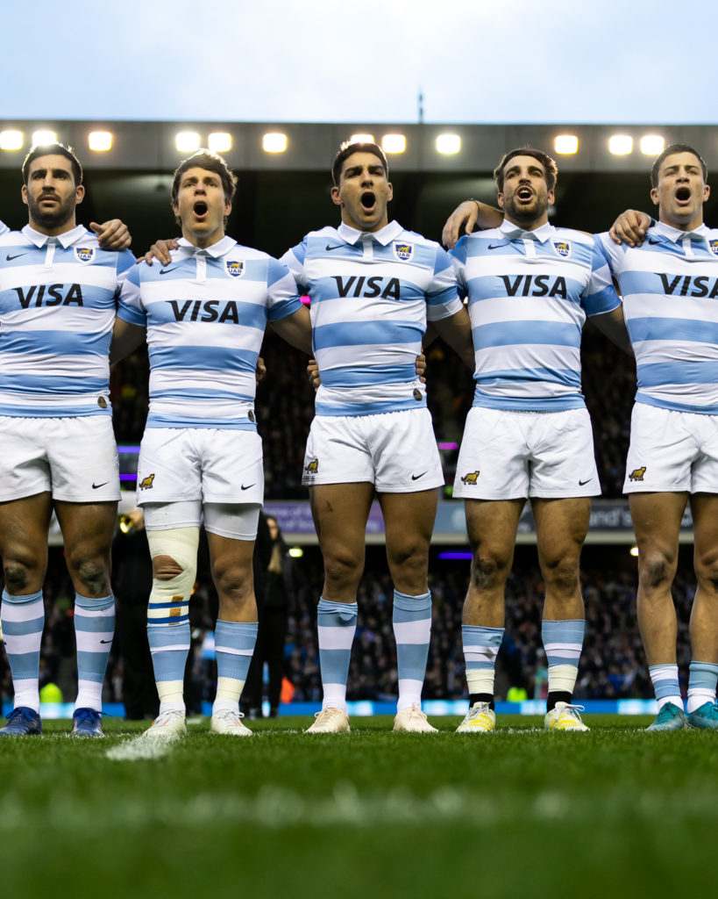
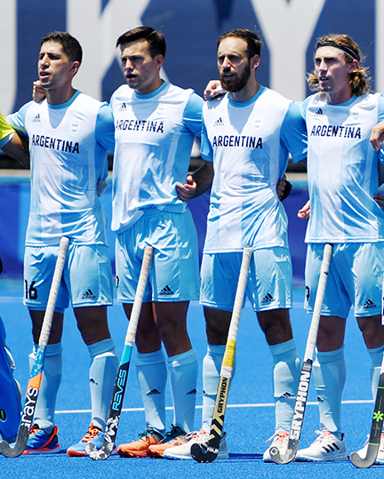
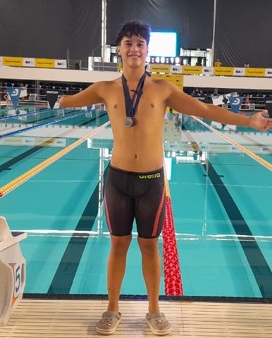

<!DOCTYPE html>
<html lang="en">
<head>
    <meta charset="UTF-8">
    <meta http-equiv="X-UA-Compatible" content="IE=edge">
    <meta name="viewport" content="width=device-width, initial-scale=1.0">
    <link rel="stylesheet" href="estilodeporte.css">
    <link rel="preconnect" href="https://fonts.googleapis.com">
    <link rel="preconnect" href="https://fonts.gstatic.com" crossorigin>
    <link href="https://fonts.googleapis.com/css2?family=Anton&family=Saira+Condensed:wght@300&display=swap" rel="stylesheet">
    <title>Deportivo Nacional</title>
</head>
<body>
    

        <h1>Deportivo Nacional</h1>
    

    

    

        <h2>Todo lo que tenes que saber acerca de las selecciones nacionales de tus deportes favoritos, en un solo lugar</h2>
    

    

    

    

        

        <a href="/indexfutbol.html">
        

            
        

        

            <h3>fútbol</h3>
            <h4>Los amistosos de la selección argentina: Cuándo juega la scaloneta y ante qué rivales se enfrentara.</h4>
        

        </a>
        

    

    

        

        <a href="/indextenis.html">
        

            
        

        

            <h3>Tenis</h3>
            <h4>Copa Davis: Argentina tropezó ante Finlandia y deberá jugar por la permanencia en el torneo.</h4>
        

        </a>
        

    

    

        

        <a href="/indexrugby.html">
        

            
        

        

            <h3>Rugby</h3>
            <h4>Los Pumas ya tienen agenda para 2023. Enterate las fechas y a que equipos se enfrentara.</h4>
        

        </a>
        

    

    

        

        <a href="/indexhockey.html">
        

            
        

        

            <h3>Hockey</h3>
            <h4>Argentina en el Mundial de hockey 2023: cómo ver los partidos de los Leones y todo lo que necesitas saber</h4>
        

        </a>
        

    

    

        

        <a href="/indexnatacion.html">
        

            
        

        

            <h3>Natación</h3>
            <h4>Lucas Leguiza integrará el seleccionado argentino para el Parapanamericano Juvenil de junio.</h4>
        

        </a>
        

    

    

    
</body>
</html>
